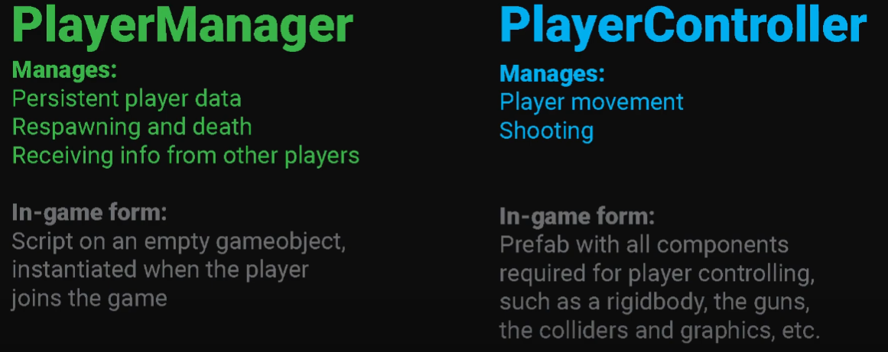

# MultiplayerFPS

## 菜单创建与photon服务器连接

* 服务器相关设置

    PhotonUnityNetworking>Resources>PhotonSeverSettings

* PUN2(游戏房间的设置)

    自动连接:PhotonNetwork.ConnectUsingSettings()

    手动连接:PhotonNetwork.ConnectToMaster() 当托管付费Photon服务器时这是有用的。
    masterServerAddress和port参数。地址可以是你的On-Premises DNS名称或一个IP。它可以包括冒号后的端口（然后传递0作为端口）或您可以单独通过端口。 
    "appID"和"gameVersion"。两者都只与Photon Cloud有关，并且当你自己托管Photon服务器时，可以设置为任何值。

    对于Photon Cloud, 使用ConnectUsingSettings()方法。它涉及到我们的Name Server自动找到一个区域的主服务器。

    PhotonNetwork使用多个回调函数来让你的游戏知道状态的变化，如“已连接”或“已加入一个游戏”。像往常对Unity一样，回调可在任何脚本里实现。override

### Scripts

* Launcher.cs

* MenuManager 单例化在Launcher中控制菜单的开关

  * Menu.cs 定义Menu类,在不同的菜单上搭载

* PlayerNameManager 玩家用户名的生成与自定义

  * PlayerPrefs的使用---数据持久化问题

    数据持久化是以键值的形式存储的，可以看作是一个字典。

    值是通过键名来读取的，当值不存在时，返回默认值。

    只支持int、string、float三种数据类型的读取

    DeleteAll DeleteKey HasKey GetFloat SetFloat...

    清除Prefs Edit>Clear All PlayerPrefs

* RoomManager 用于PlayerManager的实例化

### Unity

* xxxMenu
  搭载Menu.cs 定义MenuName 只有LoadingMenu初始时open为true
  * TMP
    显示文字
  * InputField - TMP
    处理输入的文字
    * Text Area
      放置位置
      * Placeholder
        默认出现的文字
      * Text
        输入文字的载体
  * Button
    On Click() 中选择按下按键实现的功能
    * TMP
      按键中文字
  * xxxListContent
    存放实例化的预制体,玩家 房间等
  * ButtonContainer
    按键太多时把它作为父类，搭载vertical layout group组件,垂直排版
* RoomManager
    搭载RoomManager.cs和Photon View
* EventSystem

## GamePlay

* PUN2(游戏实现)

    PhotonView是一个用于发送消息(RPCs和OnSerializePhotonView)的脚本组件。需要将PhotonView依附到游戏对象或预设上。

    整个过程，你的游戏中需要至少一个PhotonView，才能发送消息和可选的实例化/分配其他的PhotonViews。

    Any prefab must have a PhotonView component. This contains a ViewID (the identifier for network messages),who owns the object, which scripts will write and read network updates (the "observed" list) and how those updates are sent (the "Observe option").

    Remote Procedure Calls(RPC)使你**可以在一个房间里调用所有客户端上的方法**。PUN 将这些方法的列表保存在PhotonServerSettings。

    RPC使你可以调用"networked GameObjects"上的方法，对由用户输入等触发的不常用动作很有用。

    一个RPC会被在同房间里的每个玩家在相同的游戏对象上被执行，所以你可以容易地触发整个场景效果就像你可以修改某些GameObject。

    作为RPC被调用的方法必须在一个带PhotonView组件的游戏对象上。该方法自身必须要被[PunRPC]属性标记。

    要调用该方法，先访问到目标对象的PhotonView组件。而不是直接调用目标方法，调用PhotonView.RPC()并提供想要调用的方法名称：你可以发送一系列的参数，但它必须匹配该RPC方法的定义。

    防止RPCs丢失：在你连接之前设置PhotonNetwork.automaticallySyncScene = true并在房间的主客户端上使用 PhotonNetwork.LoadLevel()。如果一个远程客户端还没有加载或创建匹配的PhotonView，这个RPC就会丢失！丢失RPCs一个典型的原因就是当客户端加载新场景的时候。它只需要一个已经加载有新游戏对象的场景的客户端，并且其他客户端不能理解这个RPC（直到这些客户端也加载了相同的场景）。

    默认情况下，PUN 使用 DefaultPool 默认对象池 实例化，即从 Resources 文件夹(用photon时所有预制体都要放在Resources文件夹之中，且搭载photonview组件)加载预制体并在稍后销毁。

    一个更复杂的接口 IPunPrefabPool 可以实现在销毁对象时将其返回到对象池并在实例化时复用。在这种情况下，在 Instantiate 时并没有真的创建对象，Start() 并没有被 Unity 调用。因此，网络对象上挂载的对象必须实现 OnEnable() 和 OnDisable()

Object reference not set to an instance of an object
可能是对于组件等赋值时不存在导致