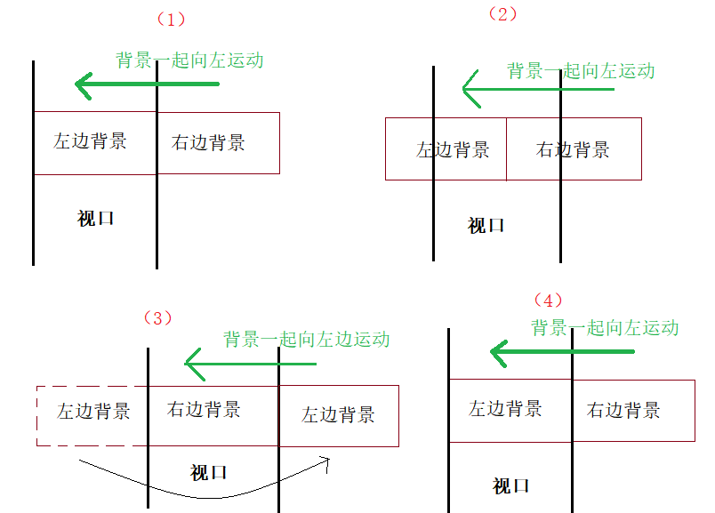

# Up——类flappy bird小游戏的实现

四个Scene场景
Main: 主菜单 管理开始游戏 帮助 退出
Level1 Level2 Level3

## 主菜单

Main场景主要为两个canvas 一个控制开始帮助退出三个按键的UI 一个控制帮助画面和返回按键的UI
在canvas上加载Main.cs脚本 控制每个按键不同的功能 再在Button对象的OnClick上加载事件
新建空对象BGM 搭载AudioSource 组件和BGM.cs
通过BGM.cs将对象设置为单例 使得其在切换场景时不销毁

```C#
    private static BGM instance;
    private void Awake()
    {
        if(instance != null)
        {
            Destroy(gameObject);
        }
        instance = this;
        DontDestroyOnLoad(this.gameObject);
    }
```

## Level1 & Level2

两个canvas 一个控制游戏中的重新开始和暂停按键 一个控制通关后显示的画面

前一个搭载GameController.cs脚本 实现游戏中重新开始和暂停功能 同时实现倒计时和倒计时结束时通关画面的激活
后一个搭载WinButton.cs脚本 实现通关画面中下一关 重新此关 回到主菜单功能的实现

* 无限滚动背景
    
复制一份相同的背景并排且共为空对象的子对象
在父对象上加载ScrollBg.cs脚本
首先获取两个背景的位置分别存储。移动过程中，当后一个背景的X超过前一个背景开始存储的X.则将前一个背景位置设为后一个背景开始的位置。然后交换，前变后，后变前。进入下一轮循环.

在小屋对象上加载CabinController.cs 脚本控制小屋的空格跳跃以及碰撞后重新开始此关

### Level1

在背景对象上加载LightCreat.cs脚本 控制闪电在一定范围内定时生成

### Level2

新建空对象BirdController上搭载BirdManager.cs脚本 控制两种鸟在随机位置的定时生成
在两种鸟的预制体上搭载BirdController.cs脚本 控制鸟向左飞行
在摄像机对象上搭载CameraFollow.cs脚本 控制摄像机跟随物体上下运动
在小屋对象上加载CabinBird.cs脚本 控制小屋碰到不同鸟时的状态变化

## Level3

游戏结束画面 返回主菜单按键
